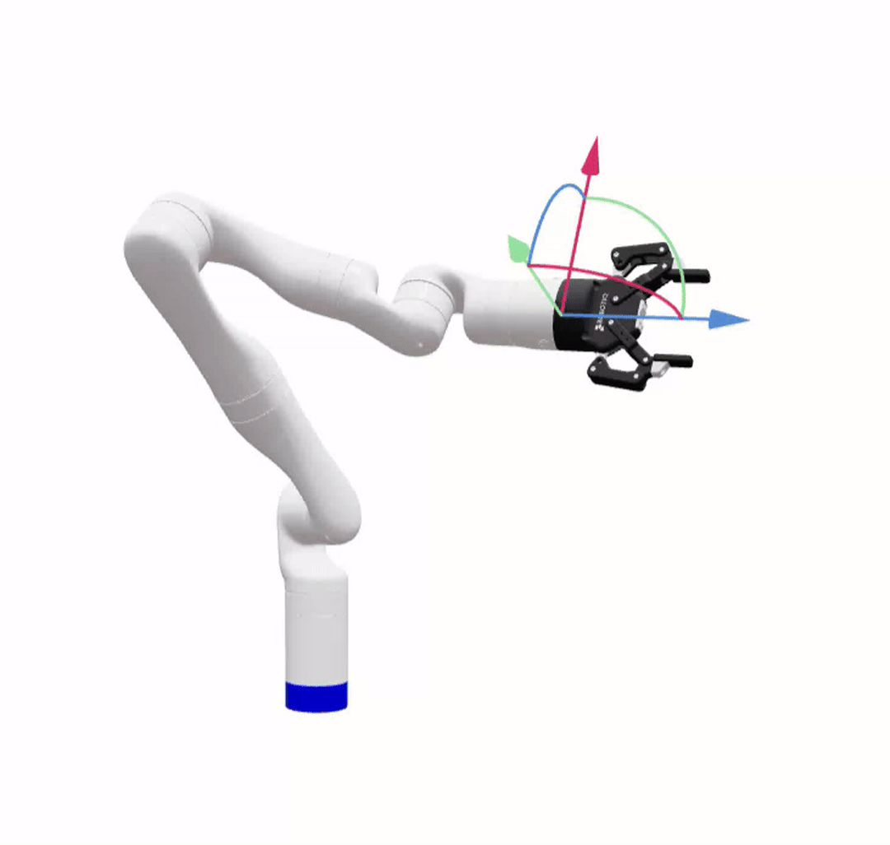

# RoboPlan

Modern robot motion planning library based on [Pinocchio](https://github.com/stack-of-tasks/pinocchio).

Refer to the [full documentation](https://roboplan.readthedocs.io) for more information.

> [!WARNING]
> This is an experimental repository!
> Until version 1.0 is released, expect some breaking changes.

---

## Packages list

The main folders found in this repo are as follows.

- `docs` : The documentation source.
- `roboplan_core` : The core C++ library.
- `roboplan_common` : Shared utilities such as Python install helpers and CMake macros.
- `roboplan_simple_ik` : A simple inverse kinematics (IK) solver.
- `roboplan_oink` : A task-based Optimal Inverse Kinematics (OInK) solver.
- `roboplan_rrt` : A Rapidly-exploring Random Tree (RRT) based motion planner.
- `roboplan_toppra` : A wrapper around the TOPP-RA algorithm for trajectory timing.
- `roboplan_cartesian_planning` : A Cartesian planner for following task-space paths.
- `roboplan_example_models` : Contains robot models used for testing and examples.
- `roboplan_examples` : Basic examples with real robot models.
- `superbuild` : Shared CMake entry point that builds every package in one tree (Pixi, vanilla CMake, and PyPI wheel builds).

---

