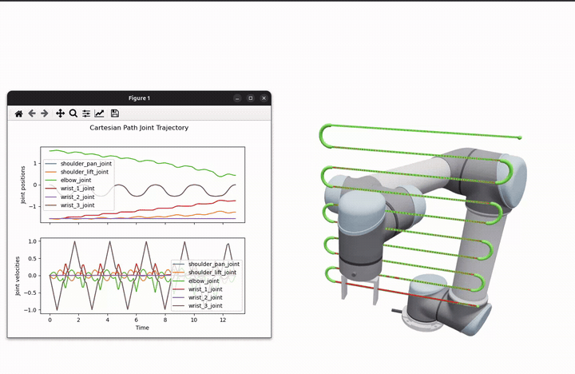

Cartesian Planning
==================

The ``roboplan_cartesian_planning`` package traces a Cartesian path in joint space using the :ref:`OInK <oink-solver>` optimal IK solver.

   Cartesian path planning with a UR5 arm.

Approach
--------

The planner builds an arc-length SE(3) reference from the waypoints (linear interpolation for position, SLERP for orientation), and then works in two stages.

**Stage 1 — resolve.**
The reference is sampled by arc length, at a density set by the path tolerance, and one OInK differential-IK problem is solved *to convergence* at each sample, seeded from the previous solution.
Because every sample is driven well inside the path tolerance before the reference advances, the resolved joint path never trails the reference, so there is no feedrate throttling or lag recovery.
If IK cannot converge at some sample (e.g., near a singularity or against a joint limit), the planner returns an error naming where it failed.
The result is purely geometric and carries no timing.
Joint **position** limits are enforced inside the QP; a ``VelocityLimit`` is also applied there, but only to cap how far a single IK iteration may move (``dt`` times the joint velocity limit).

**Stage 2 — time.**
The resolved joint path is decimated to its shape-carrying waypoints and time-parameterized with :doc:`TOPP-RA <trajectory_generation>`.
This is done over a straight-segment + circular-blend geometry, so the trajectory respects the robot's joint **velocity and acceleration** limits.
``toppra_blend_deviation`` bounds how far a rounded corner may stray from the sharp one.

Both speed modes run both stages and differ only in what happens after the TOPP-RA pass:

- ``TimeOptimal``: returns that trajectory as is.
  It is time-optimal under the joint limits, so the tool speed varies along the path.
- ``Bounded``: uniformly slows the whole motion until the tool also obeys the commanded Cartesian maxima
  (``max_linear_speed`` / ``max_angular_speed`` and ``max_linear_acceleration`` / ``max_angular_acceleration``).
  Re-timing by a factor :math:`m` divides tool speed by :math:`m` and tool acceleration by :math:`m^2`, which is applied by re-running
  TOPP-RA with the joint limits scaled the same way, so the joint limits stay satisfied for free.
  The commanded values therefore act as **maxima**, not fixed values: a motion the joint limits already keep slower than the caps is left alone.

Both modes return a ``JointTrajectory``.
Quality metrics are computed on demand from that trajectory: ``computePeakLimitRatios`` returns the peak velocity/acceleration-to-limit ratios so the caller can see how close the result is to the joint limits, and ``computeAchievedPathLength`` returns the Cartesian distance traced by the tip frames.
Use ``Bounded`` for a predictable, velocity- and acceleration-limited Cartesian motion, and ``TimeOptimal`` when time-optimality matters.

Multiple end effectors
----------------------

A ``CartesianPath`` may contain more than one end-effector frame.
The planner builds one tracking ``FrameTask`` per frame and advances all of them along a shared normalized path parameter, so the motions are traced simultaneously.
The convergence check uses the worst-case error across all frames, and ``computeAchievedPathLength`` sums the Cartesian distance across them.

Customizing the IK problem
--------------------------

By default the planner builds its own OInK solver.
This solver has one ``FrameTask`` per end-effector plus a nullspace ``ConfigurationTask``.
It is bounded by ``VelocityLimit`` and ``PositionLimit`` constraints based on the robot joint limits.

For full control over the differential-IK problem, you can instead construct the planner with a ``CartesianPlannerComponents``.
This lets you supply your own:

- ``oink``: the :ref:`OInK <oink-solver>` solver instance.
- ``tracking_tasks``: one ``FrameTask`` per end-effector, ordered to match the path's tip frames.
- ``extra_tasks``: additional tasks (e.g., a custom nullspace posture task).
- ``constraints`` and ``barriers``: any constraints/control barrier functions to apply at every step.

The planner reuses these objects across all ``plan()`` calls and never mutates them apart from the tracking-task targets.
Any seed-dependent setup is the caller's responsibility.
In this mode, the OInK-related fields of ``CartesianPlannerOptions`` (costs, gains, limits) are ignored.
However, the timing/tolerance fields (``dt``, speeds, ``max_*_error``, ``speed_mode``, scales) still apply.
