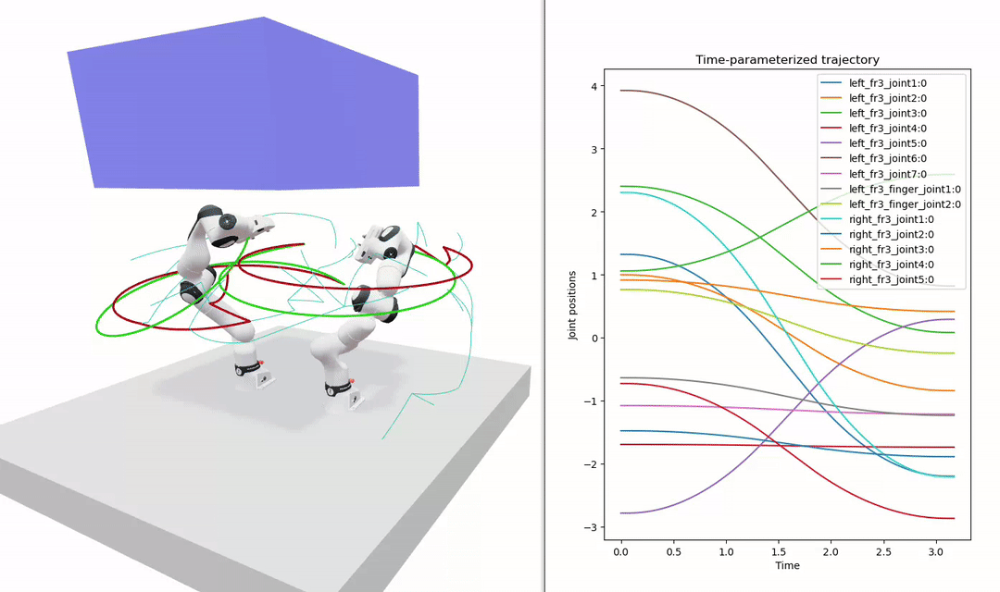

Sampling-Based Planning
=======================

Sampling-based motion planners search for a collision-free path between a start and goal configuration by randomly sampling the robot's configuration space and incrementally building a tree (or trees) of valid motions.
Rather than reasoning explicitly about the geometry of obstacles, they rely on a *collision checker* as a black box and probe the space until a connected, collision-free path is found.
This makes them well suited to high-dimensional problems such as articulated arms, where explicitly representing the free space is intractable.

RoboPlan implements the **Rapidly-exploring Random Tree (RRT)** family of planners in the ``roboplan_rrt`` package.

   RRT planning for a dual-arm Franka system.

The classic single-tree RRT, the bidirectional RRT-Connect variant, and the asymptotically optimal RRT* are all supported — and RRT* can be combined with RRT-Connect.
There are many other variants of RRT, as well as other types of sampling-based planning algorithms.
We would always appreciate new contributions!

Rapidly-Exploring Random Trees (RRT)
------------------------------------

The basic RRT grows a single tree outward from the start configuration.
At each iteration the planner:

1. **Samples** a random configuration from the configuration space (with some probability, it samples the goal directly — see *goal biasing* below).
2. Finds the **nearest** existing node in the tree to that sample.
3. **Extends** from the nearest node a bounded step (``max_connection_distance``) toward the sample.
4. Adds the new node to the tree if the connecting edge is **collision-free**.

The tree is biased to grow toward unexplored regions of the space, which is what gives RRT its "rapidly-exploring" character.
Planning terminates successfully once the newest node can be connected directly to the goal.

**Goal biasing.**
With probability ``goal_biasing_probability``, the planner samples the goal configuration instead of a random one.
This pulls the tree toward the goal and speeds up convergence, while still sampling randomly often enough to escape local minima around obstacles.

RRT was introduced by `LaValle (1998) <http://msl.cs.illinois.edu/~lavalle/papers/Lav98c.pdf>`_.

RRT-Connect
~~~~~~~~~~~

RRT-Connect grows **two** trees simultaneously — one rooted at the start and one rooted at the goal — and attempts to join them.
Enabling ``rrt_connect`` switches the planner into this mode.

On each iteration, one tree is extended toward a random sample (the ``EXTEND`` step), and then the *other* tree greedily extends toward that tree's new frontier node, taking repeated steps until it either reaches the node or hits an obstacle (the ``CONNECT`` step).
The two trees then swap roles for the next iteration.
Whenever the frontier of one tree can be connected to the nearest node of the other, the two halves are concatenated into a complete start-to-goal path.

Because each tree actively reaches for the other, RRT-Connect typically converges much faster than single-tree RRT.
Goal biasing is therefore disabled in this mode: the bidirectional ``CONNECT`` step already pulls the trees toward one another, so the planner samples uniformly at random instead of repeatedly aiming at the fixed opposite endpoint.

RRT-Connect was introduced by `Kuffner and LaValle (2000) <http://msl.cs.illinois.edu/~lavalle/papers/KufLav00.pdf>`_.

RRT*
~~~~

Plain RRT and RRT-Connect stop at the *first* path they find, which is typically jagged and far from optimal.
RRT* augments tree growth with an *optimization* step so that, given enough samples, the path it returns converges toward the shortest one.
Enabling ``rrt_star`` switches on this behavior; it can be combined with ``rrt_connect``, in which case both trees are optimized.

Every node stores its **cost-to-come** — the length of the path from the tree root to that node.
When a new node is added, RRT* does two extra things beyond plain RRT:

1. **Choose the best parent.** Rather than always attaching the new node to the nearest existing node, RRT* considers every node within ``rewire_distance`` and connects through whichever collision-free neighbor yields the lowest cost-to-come.
2. **Rewire neighbors.** It then checks whether routing any of those same neighbors *through the new node* would lower their cost-to-come, and reconnects them if so (propagating the cost change down through their subtrees).

Over many iterations, this incremental rewiring continually straightens and shortens the tree, removing the wandering detours that plain RRT leaves behind.

``rewire_distance`` is the configuration-space radius of the neighborhood considered when choosing parents and rewiring, expressed in the same units as ``max_connection_distance``.
It should generally be at least as large as ``max_connection_distance`` so that nodes a single connection step away are considered; larger values explore more neighbors and yield shorter paths, at the cost of more collision checks per node.

To actually reap RRT*'s optimization, the planner must keep sampling past the first solution — see :ref:`fast_return <fast-return>` below.

RRT* was introduced by `Karaman and Frazzoli (2011) <https://arxiv.org/abs/1105.1186>`_.

.. _fast-return:

Returning Early vs. Using the Full Budget
~~~~~~~~~~~~~~~~~~~~~~~~~~~~~~~~~~~~~~~~~~~

By default (``fast_return = true``), the planner returns as soon as it finds the first complete path, in every mode.
Setting ``fast_return = false`` instead keeps planning until the node or time budget (``max_nodes`` / ``max_planning_time``) is exhausted, then returns the lowest-cost path found.

This flag is what unlocks RRT*'s optimality: because RRT* only improves the tree as it samples, it must keep running to refine the solution, so pair ``rrt_star = true`` with ``fast_return = false`` for asymptotically optimal paths.
With plain RRT or RRT-Connect — which never rewire — disabling ``fast_return`` simply keeps the cheapest of the independently discovered paths, which rarely improves enough to justify the extra time.

Note that even with ``fast_return = true``, RRT* still rewires the tree as it grows, so the first path it returns is already noticeably shorter than plain RRT's; you only forgo the additional refinement that the remaining budget would buy.

State Spaces and the ``dynotree`` Library
~~~~~~~~~~~~~~~~~~~~~~~~~~~~~~~~~~~~~~~~~~~

Nearest-neighbor lookups dominate the cost of RRT: every iteration queries the tree for the node closest to a new sample.
RoboPlan delegates these queries to `dynotree <https://github.com/quimortiz/dynotree>`_, a header-only k-d tree library that is vendored into ``roboplan_rrt/include/dynotree``.

**k-d trees for efficiency.**
Internally, dynotree partitions the state space with a k-d tree, so nearest-neighbor queries run in roughly logarithmic rather than linear time in the number of nodes.
The tree splits along whichever dimension currently has the widest spread, and its branch-and-bound search uses each state space's ``distance_to_rectangle`` routine to prune entire subtrees that cannot contain a closer neighbor.
This keeps RRT efficient even as the tree grows to thousands of nodes.

**Proper state spaces.**
A naive planner treats every joint as a real-valued coordinate in :math:`\mathbb{R}^n` and measures distances with a plain Euclidean norm.
This is incorrect for joints whose configuration space is not a Euclidean line.
A continuous (unlimited) revolute joint, for example, lives on a circle: the angles :math:`-\pi` and :math:`+\pi` are the same point, and the shortest distance between two angles must wrap around.
dynotree models each degree of freedom with the *correct* topology and supplies matching distance, interpolation, and sampling operations:

- **Rn** — bounded real-valued coordinates (:math:`\mathbb{R}^n`), used for prismatic and limited revolute joints.
- **SO(2)** — the circle group, used for continuous revolute joints so that distances wrap correctly across :math:`\pm\pi`.
- **SE(2)** — the planar group :math:`\mathbb{R}^2 \times SO(2)`, used for mobile bases and other planar joints, combining a 2D translation with a wrapping heading angle.
- **SO(3)** — the rotation group, available for 3D orientations (e.g., spherical joints).

RoboPlan builds a ``dynotree::Combined`` state space by concatenating one of these components per joint in the planning group.
Continuous joints are mapped to ``SO2``, planar joints to ``Rn:2`` + ``SO2`` (i.e., SE(2)), and ordinary single-DOF joints to ``Rn:1``.
Because the k-d tree understands this structure, its nearest-neighbor results respect the true configuration-space metric — for example, finding that a sample near :math:`+\pi` is close to a tree node near :math:`-\pi`.

Configuration
~~~~~~~~~~~~~

The planner is configured through ``RRTOptions``:

+-----------------------------------+------------------------------------------------------------+-----------+
| Parameter                         | Description                                                | Default   |
+===================================+============================================================+===========+
| ``group_name``                    | Joint group to plan for                                    | ""        |
+-----------------------------------+------------------------------------------------------------+-----------+
| ``max_nodes``                     | Maximum number of nodes to sample before giving up         | 1000      |
+-----------------------------------+------------------------------------------------------------+-----------+
| ``max_connection_distance``       | Maximum configuration distance between two nodes           | 3.0       |
+-----------------------------------+------------------------------------------------------------+-----------+
| ``collision_check_step_size``     | Configuration-space step size for collision checking edges | 0.05      |
+-----------------------------------+------------------------------------------------------------+-----------+
| ``collision_check_use_bisection`` | Use bisection instead of linear edge collision checking    | false     |
+-----------------------------------+------------------------------------------------------------+-----------+
| ``goal_biasing_probability``      | Probability of sampling the goal instead of a random node  | 0.15      |
+-----------------------------------+------------------------------------------------------------+-----------+
| ``max_planning_time``             | Maximum planning time in seconds (``<= 0`` disables)       | 0.0       |
+-----------------------------------+------------------------------------------------------------+-----------+
| ``rrt_connect``                   | Use RRT-Connect (two trees) instead of single-tree RRT     | false     |
+-----------------------------------+------------------------------------------------------------+-----------+
| ``rrt_star``                      | Use RRT* to optimize the tree and return shorter paths     | false     |
+-----------------------------------+------------------------------------------------------------+-----------+
| ``rewire_distance``               | Neighborhood radius for RRT* rewiring (only if rrt_star)   | 5.0       |
+-----------------------------------+------------------------------------------------------------+-----------+
| ``fast_return``                   | Return on first path, or plan until the budget is spent    | true      |
+-----------------------------------+------------------------------------------------------------+-----------+

Usage Example
~~~~~~~~~~~~~

.. code-block:: python

   from roboplan.core import JointConfiguration, Scene
   from roboplan.rrt import RRTOptions, RRT

   # Set up the scene from a robot description.
   scene = Scene("robot", urdf=urdf_xml, srdf=srdf_xml, package_paths=package_paths)

   # Configure and construct the planner.
   options = RRTOptions(
       group_name="arm",
       max_connection_distance=3.0,
       goal_biasing_probability=0.15,
       max_planning_time=5.0,
       rrt_connect=True,
       rrt_start=False,
       fast_return=True,
   )
   rrt = RRT(scene, options)

   # Define the start and goal configurations.
   start = JointConfiguration()
   start.positions = q_start
   goal = JointConfiguration()
   goal.positions = q_goal

   # Plan a collision-free joint-space path.
   path = rrt.plan(start, goal)

The resulting :class:`JointPath` is a sequence of collision-free waypoints.
It is typically post-processed with :doc:`path shortcutting <path_shortcutting>` to remove redundant detours, and then timed into a smooth, executable trajectory with :doc:`trajectory_generation`.

Visualization and Debugging
~~~~~~~~~~~~~~~~~~~~~~~~~~~

Sampling-based planners are inherently random, so inspecting *how* a tree explored the space is invaluable when a plan fails, takes too long, or produces an unexpected detour.
The RRT planner retains every node it sampled, and exposes the start and goal trees through ``rrt.getNodes()`` after planning.

The :func:`visualizeTree` helper (in ``roboplan.rrt``) renders these trees in a `Viser <https://viser.studio>`_ scene.
For each tree edge, it runs forward kinematics along the connecting motion and draws the resulting end-effector path as line segments, so you can see exactly where the planner reached.
The start and goal trees are drawn in different colors, which makes the bidirectional growth of RRT-Connect easy to follow.

.. code-block:: python

   from roboplan.rrt import visualizeTree

   # After a successful rrt.plan(...) call:
   visualizeTree(
       viz,                       # a ViserVisualizer instance
       scene,
       rrt,
       frame_names=["tool0"],     # end-effector frame(s) to trace
       max_step_size=0.05,        # interpolation resolution along each edge
   )

For example, a dense, space-filling tree that never reaches the goal usually points to an overly small ``max_connection_distance`` or a goal trapped behind obstacles.
