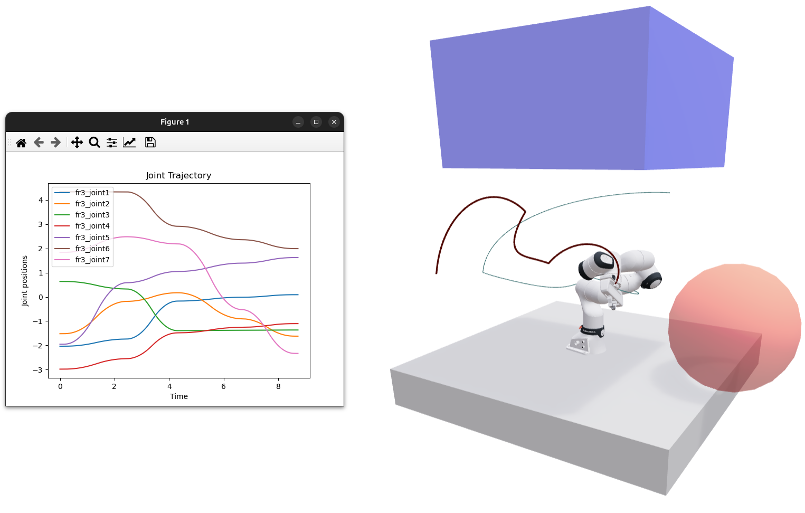
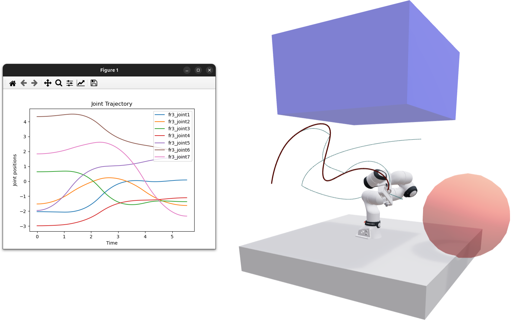
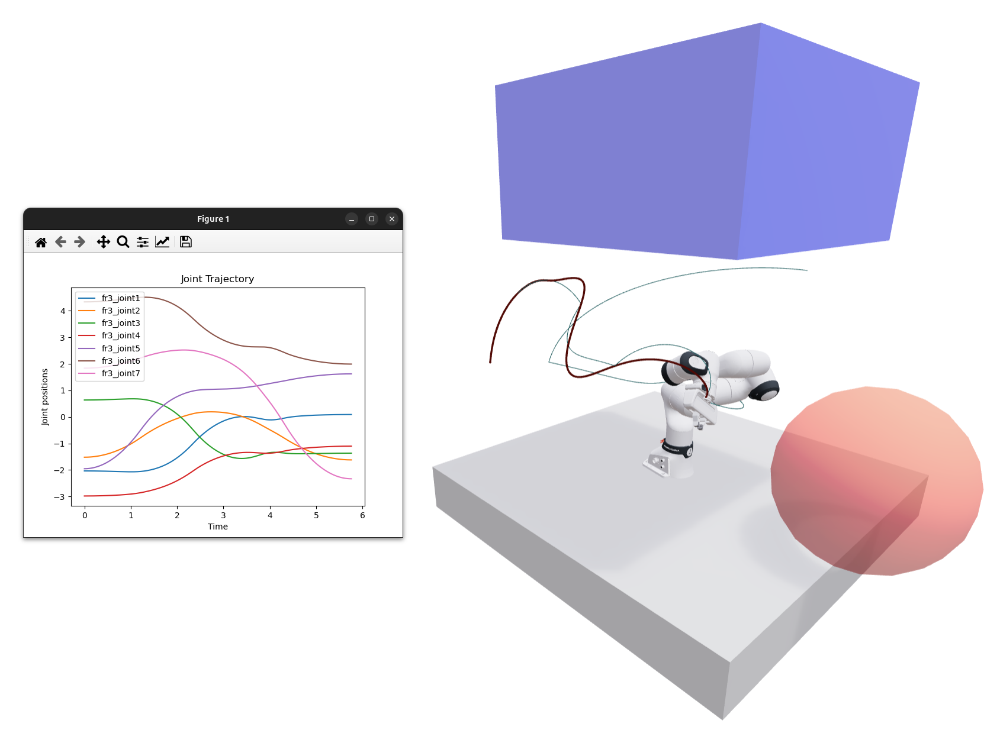

Trajectory Generation
=====================

We currently use the `Time-Optimal Path Parameterization based on Reachability Analysis (TOPP-RA) <https://github.com/hungpham2511/toppra>`_ method for trajectory generation.

Given a path (whether manually specified or from a motion planner), it must be timed into a trajectory.
This trajectory describes how the robot follows a path over time, usually under specific constraints such as maximum velocity, acceleration, and jerk.

The TOPP-RA wrapper in RoboPlan contains three separate modes.

**Hermite**: This fits a cubic Hermite spline with zero velocity and acceleration at *all* points.
This ensures that the trajectory exactly tracks the path by coming to a full stop at each waypoint.
One benefit of this approach is that if the path is collision-free, the resulting trajectory is also guaranteed to be collision-free.
However, this can come at the expense of execution speed for multi-waypoint paths, since the robot has to stop often.

   Timed trajectory with the Hermite mode. This trajectory takes approximately 8.5 seconds.

**Cubic**: This fits a cubic spline with zero velocity and acceleration only at the *endpoints*.
This means that the robot does not necessarily stop at intermediate waypoints, which can lead to much smoother paths.
However, for paths with high curvature, this can cause sufficient overshoot and deviation from the path that collisions could occur.
Our approach specifically checks for collisions and falls back to the Hermite fitting method if any are found.

   Timed trajectory with the Cubic mode. This trajectory is significantly faster, at about 5.5 seconds, but has collisions.

**Adaptive**: This approach gets the best of both the previous approaches.
We can iteratively check for collisions and add intermediate waypoints near collision points to shape the resulting trajectory.
These intermediate waypoints are added along the path itself (for example, at the midpoint between two existing waypoints), meaning they are guaranteed to be collision-free if the original path segments were also collision-free.
While this can effectively trade off fast and smooth execution with collision avoidance, iterating can take a long time and can fail after several iterations.
This method is discussed in Section 3.5 of `Richter et al. (2013) <https://groups.csail.mit.edu/rrg/papers/Richter_ISRR13.pdf>`_.

   Timed trajectory with the Adaptive mode. This trajectory takes almost 6 seconds, which is slightly longer than the Cubic mode, but has no collisions.
