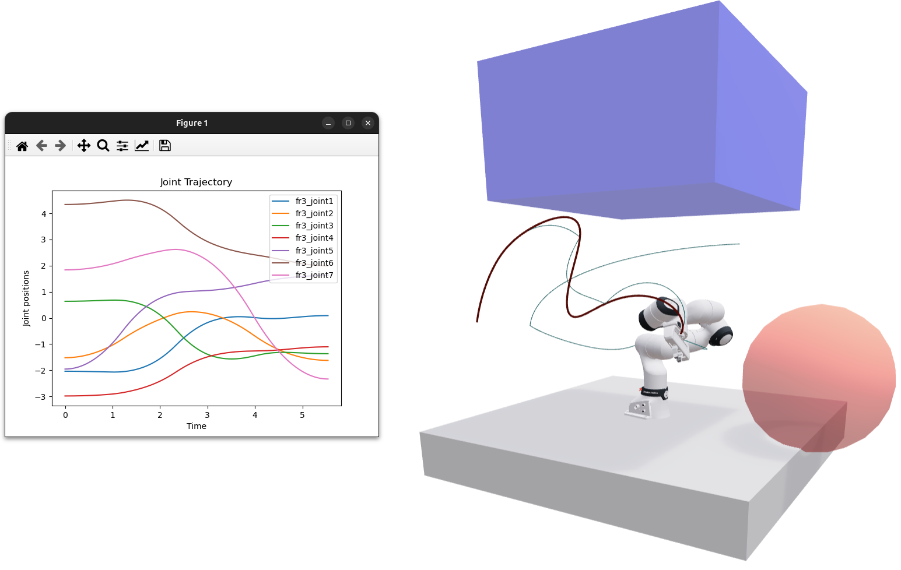
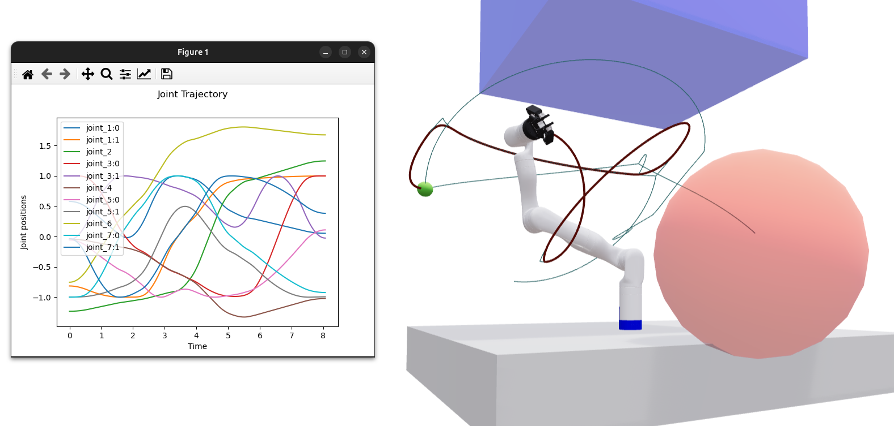

Trajectory Generation
=====================

We currently use the `Time-Optimal Path Parameterization based on Reachability Analysis (TOPP-RA) <https://github.com/hungpham2511/toppra>`_ method for trajectory generation.

Given a path (whether manually specified or from a motion planner), it must be timed into a trajectory.
This trajectory describes how the robot follows a path over time, usually under specific constraints such as maximum velocity, acceleration, and jerk.

The TOPP-RA wrapper has four modes, selected with ``TOPPRAOptions.mode`` (``SplineFittingMode``).

**Hermite**: This fits a cubic Hermite spline with zero velocity at *all* waypoints.
The trajectory exactly tracks the path by coming to a full stop at each waypoint, so if the path is collision-free, the trajectory is too.
However, multi-waypoint paths execute slowly, since the robot has to stop often.

.. figure:: ../media/toppra_hermite.png
   :width: 600px

   Timed trajectory with the Hermite mode. This trajectory takes approximately 8.5 seconds.

**Cubic**: This fits a cubic spline with zero acceleration only at the *endpoints*.
The robot does not necessarily stop at intermediate waypoints, which can lead to much smoother paths.
However, on paths with high curvature the spline can overshoot enough that collisions could occur, so the result is collision checked and falls back to the Hermite fitting method if any are found.

   Timed trajectory with the Cubic mode. This trajectory is significantly faster, at about 5.5 seconds, but has collisions.

**Adaptive**: This approach iteratively collision checks the Cubic spline and adds intermediate waypoints near collisions to shape the trajectory.
The waypoints are added along the path itself (for example, at the midpoint between two existing waypoints), so they are collision-free if the original path segments were.
This trades off fast, smooth execution against collision avoidance, but iterating can take a long time, and if no collision-free spline is found within ``max_adaptive_iterations``, it falls back to the Hermite fitting method.
This method is discussed in Section 3.5 of `Richter et al. (2013) <https://groups.csail.mit.edu/rrg/papers/Richter_ISRR13.pdf>`_.

.. figure:: ../media/toppra_adaptive.png
   :width: 600px

   Timed trajectory with the Adaptive mode. This trajectory takes almost 6 seconds, which is slightly longer than the Cubic mode, but has no collisions.

**Linear Blend**: This represents the path as straight-line segments joined by circular corner blends, which is the geometry used by the time-optimal trajectory generation method of `Kunz and Stilman (2012) <https://www.roboticsproceedings.org/rss08/p27.pdf>`_.
Unlike the spline modes, the straight segments have exactly zero curvature, so densely sampled or slightly noisy waypoints do not inflate the acceleration constraint and slow down the trajectory.
Each corner is rounded within ``max_blend_deviation``, which bounds how far the blended path may stray from the original sharp corner.
As with the Cubic mode, the blended path is checked for collisions and falls back to the Hermite fitting method if any are found.

   Timed trajectory with the Linear Blend mode. Note the rounded corners of the path.
